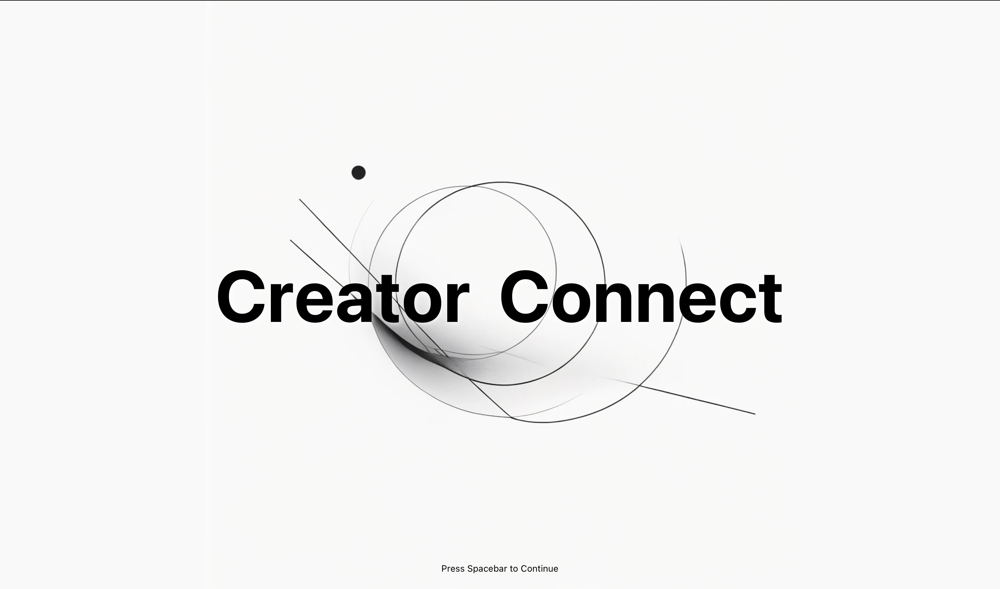

# 📌 Creator Connect
Creator Connect is a platform designed to help people find collaborators for projects. Whether you're a student, a freelancer, or an entrepreneur, Creator Connect makes it easy to post ideas, showcase projects, and find like-minded individuals to work with.

## 🚀 Features

- 🔍 **Find Collaborators** – Search for project partners based on skills and interests.
- 📌 **Post Your Project** – Share your idea and attract the right people.
- 🌟 **Project Showcase** – Display your work with feedback, comments, and links.
- 📅 **Networking & Community** – Connect with people in your industry.

---

## 📌 Usage

### **Posting a Project**
1. Go to the **Dashboard**.
2. Click **"Create New Project"**.
3. Enter details (title, description, skills needed, etc.).
4. Publish your project to the community.

### **Finding a Project**
1. Browse the **Explore** page.
2. Use filters to find relevant projects.
3. Click on a project to see details.
4. Message the creator to collaborate.

---

## 🛠️ Current Tech Stack:
- **Frontend:** React + Vite
- **Styling:** CSS (**Tailwind Soon!**)

---

## 📬 Contact

If you have any questions or suggestions, feel free to reach out:

📧 **Email:** [ianzhang@gmail.com](mailto:ianzhang@gmail.com)  
🐙 **GitHub:** [PecoAnnArbor](https://github.com/PecoAnnArbor)  
🔗 **Website:** [ianzhang.dev](https://ianzhang.dev)
